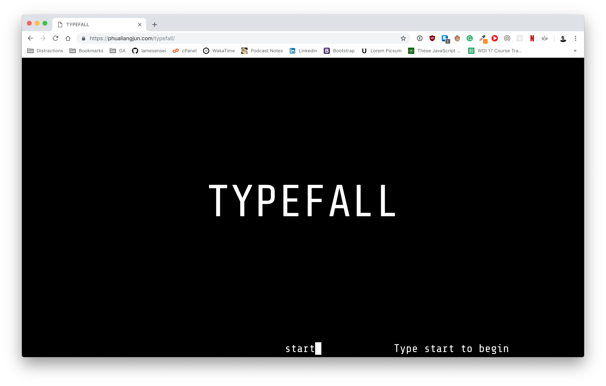

# TYPEFALL



A javascript based game involving typing.

## Features

- 100% browser-based typing game
- No mouse required - just type
- Hidden console to adjust settings

## Instructions

Clone the the repo and open index.html in the browser to play!

```
git clone https://github.com/lamesensei/typefall.git
```

Or visit https://phualiangjun.com/typefall to play immediately.

### Options

`start` - start the game on default difficulty

`console` - launch options prompts

`saiyan` - activate motivation - you're gonna love it

## Technologies

- CSS3 - Keyframe Animations
- JS - DOM manipulation
- BOOTSTRAP - Ease of alignment
